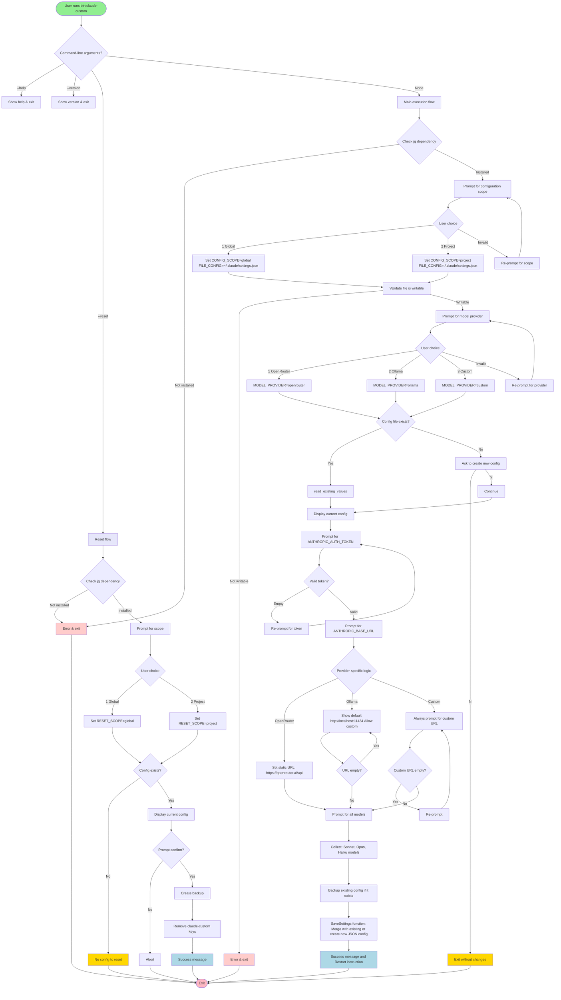
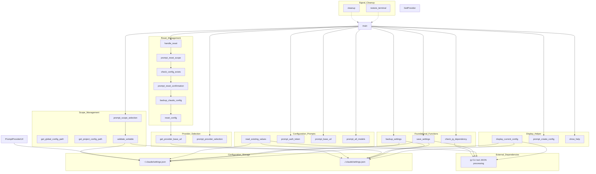
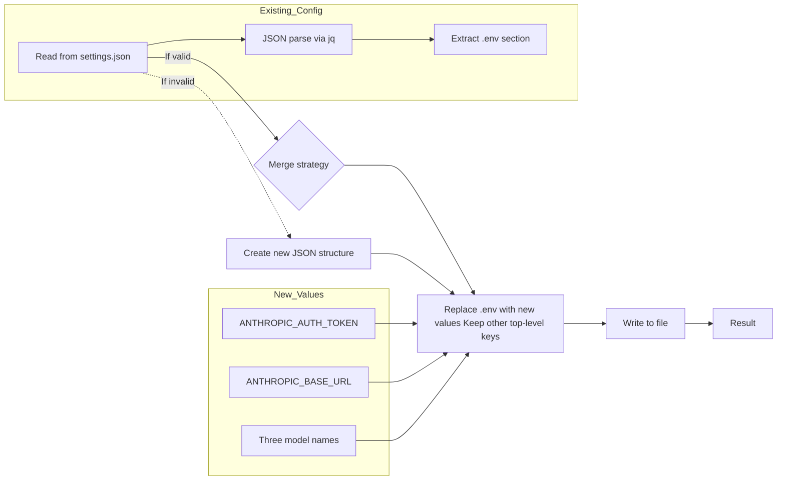
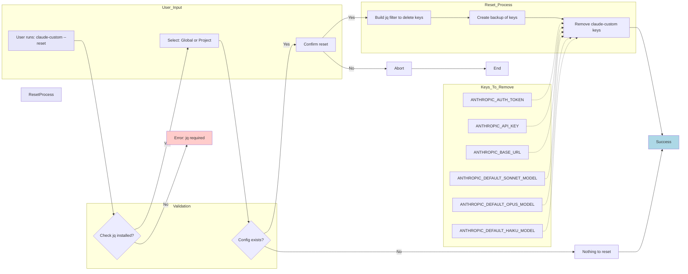
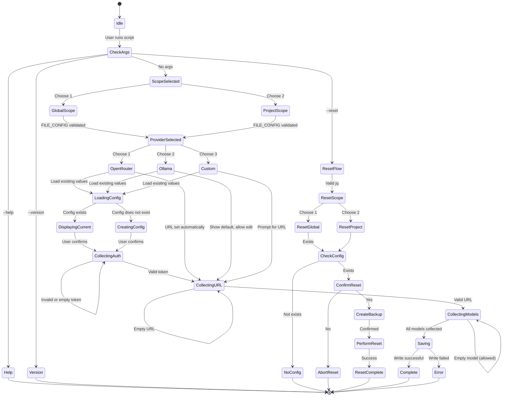

### Flow Diagram

### Component Architecture

### Data Flow: Configuration Merging

### Data Flow: Configuration Reset

### State Machine: Configuration Scope & Provider

---

**Legend:**
- **Rounded rectangles**: Processes/functions
- **Diamonds**: Decision points
- **Hexagons**: User interactions
- **Cylinders**: Data storage (files)
- **Arrows**: Control flow/data flow
- **Dashed arrows**: Dependencies/associations
