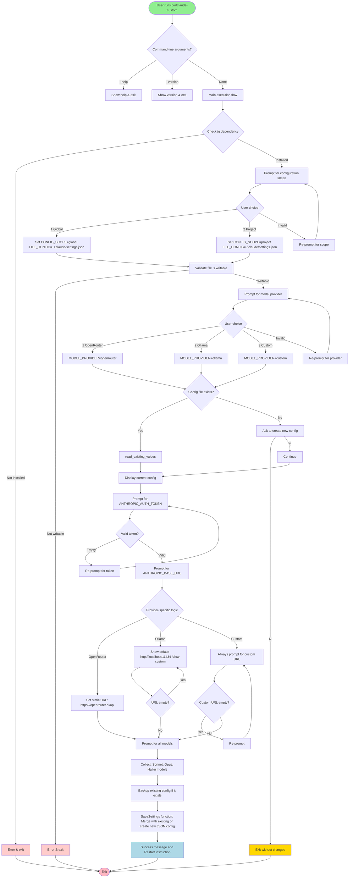
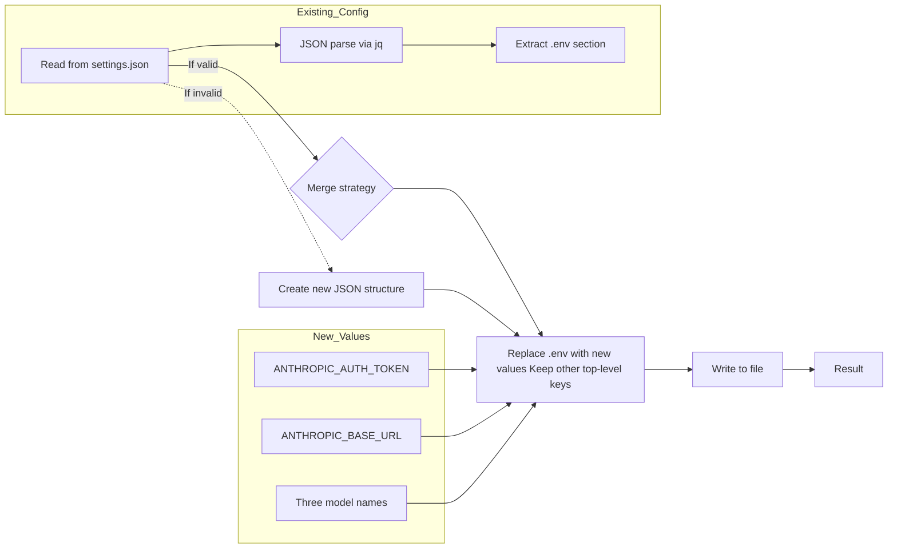
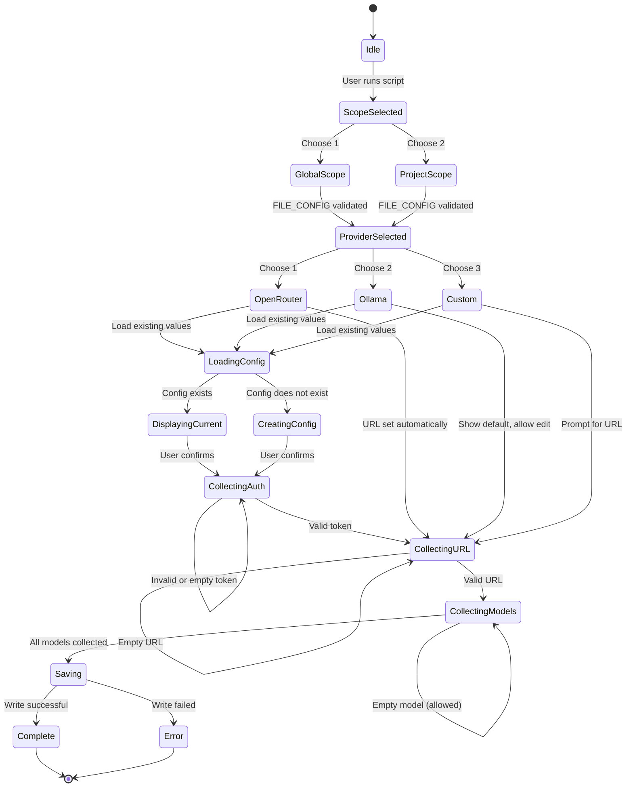

<div align="center">

# Claude Custom

*An interactive Bash CLI tool that configures Claude Code's `settings.json` with your preferred AI model provider. Set up OpenRouter, Ollama, or a custom endpoint in seconds.*

<br>

[](https://opensource.org/licenses/MIT) [](https://www.gnu.org/software/bash/) [](https://github.com/obiwancenobi/claude-custom) [](https://github.com/obiwancenobi/claude-custom/releases)

</div>

---

## 🖼️ Preview


## ✨ Features

- **Flexible Scope**: Configure globally (`~/.claude/settings.json`) or per-project (`.claude/settings.json`)
- **Provider Support**:
  - **OpenRouter** — Pre-configured API endpoint
  - **Ollama** — Local LLM at `localhost:11434`
  - **Custom** — Your own base URL
- **Secure Input**: API tokens entered with masked input (echo disabled)
- **Smart Merging**: Preserves existing settings while updating credentials
- **Automatic Backups**: Timestamped backups before any changes

## 🔒 Security & Privacy

**100% local operation — zero data transmission. This tool only:**

- Write to your local settings.json
- Store credentials on your machine
- Mask input during token entry
- Let you choose config location (global or project)

Your API keys never leave your computer. The script is a configuration helper only — Claude Code itself handles all API communication.

## 📋 Requirements

- **Bash** 4.0 or later
- **jq** — Command-line JSON processor

Install jq if needed:

```bash
# macOS
brew install jq

# Ubuntu/Debian
sudo apt-get install jq

# Fedora
sudo dnf install jq

# Arch Linux
sudo pacman -S jq

# Alpine Linux
apk add jq
```

## 🚀 Installation

### Option 1: Homebrew (macOS/Linux) — Easiest

```bash
# Tap the repository (if available) or install directly
brew install obiwancenobi/claude-custom/claude-custom

# Or update and upgrade
brew update && brew upgrade claude-custom
```

### Option 2: Quick Install (One-Liner)

Download and install directly to `/usr/local/bin`:

```bash
# Using curl
curl -sSL https://raw.githubusercontent.com/obiwancenobi/claude-custom/main/claude-custom | sudo tee /usr/local/bin/claude-custom > /dev/null && sudo chmod +x /usr/local/bin/claude-custom

# Using wget
wget -qO- https://raw.githubusercontent.com/obiwancenobi/claude-custom/main/claude-custom | sudo tee /usr/local/bin/claude-custom > /dev/null && sudo chmod +x /usr/local/bin/claude-custom
```

### Option 3: Manual Installation

#### Copy (requires sudo)

```bash
sudo cp claude-custom /usr/local/bin/
sudo chmod +x /usr/local/bin/claude-custom
```

#### Symlink (no need to copy)

```bash
ln -sf "$(pwd)/claude-custom" /usr/local/bin/claude-custom
```

#### Clone & Install

```bash
git clone https://github.com/yourusername/claude-custom.git
cd claude-custom
sudo cp claude-custom /usr/local/bin/
sudo chmod +x /usr/local/bin/claude-custom
```

### Option 4: Local Use (No Install)

Run directly from the repository without installing:

```bash
./claude-custom
# or
./claude-custom --version
```

### Verify Installation

```bash
claude-custom --version
# Claude Custom v1.0.0
```

### Uninstall

```bash
sudo rm /usr/local/bin/claude-custom
```

## 🎯 Usage

Start the interactive configuration wizard:

```bash
claude-custom
```

### Command-Line Options

```bash
claude-custom --help     # Display this help message
claude-custom --version  # Show version information
```

### What Gets Configured

The tool writes these environment variables to Claude Code's `settings.json`:

| Variable | Purpose |
|-----------|---------|
| `ANTHROPIC_AUTH_TOKEN` | Your API key (required) |
| `ANTHROPIC_BASE_URL` | API endpoint URL (auto-set for OpenRouter/Ollama) |
| `ANTHROPIC_DEFAULT_SONNET_MODEL` | Default Sonnet model name |
| `ANTHROPIC_DEFAULT_OPUS_MODEL` | Default Opus model name |
| `ANTHROPIC_DEFAULT_HAIKU_MODEL` | Default Haiku model name |

## 🛠️ How It Works

1. **Choose scope** — Decide between global or project configuration
2. **Select provider** — Pick OpenRouter, Ollama, or Custom
3. **Enter credentials** — Provide API token (masked), base URL (if custom), and model names
4. **Save & backup** — Existing config is backed up with timestamp, then updated

On first run, if no configuration exists, you'll be prompted to create one. Subsequent runs will show current values and allow you to update them.

### Flow Diagram



### Component Architecture

```mermaid
flowchart TB
    Main[main]

    subgraph Foundational_Functions
        CheckJq[check_jq_dependency]
        SaveSettings[save_settings]
        Backup[backup_settings]
    end

    subgraph Scope_Management
        GetGlobalPath[get_global_config_path]
        GetProjectPath[get_project_config_path]
        ValidateWritable[validate_writable]
        PromptScope[prompt_scope_selection]
    end

    subgraph Provider_Selection
        GetProviderUrl[get_provider_base_url]
        PromptProvider[prompt_provider_selection]
    end

    subgraph Configuration_Prompts
        ReadValues[read_existing_values]
        PromptAuth[prompt_auth_token]
        PromptUrl[prompt_base_url]
        PromptModels[prompt_all_models]
    end

    subgraph Display_Helper
        DisplayConfig[display_current_config]
        PromptCreate[prompt_create_config]
        ShowHelp[show_help]
    end

    subgraph Signal_Cleanup
        Cleanup[cleanup]
        RestoreTerm[restore_terminal]
    end

    subgraph External_Dependencies
        Jq[jq CLI tool JSON processing]
    end

    subgraph Configuration_Storage
        GlobalConfig[~/.claude/settings.json]
        ProjectConfig[./.claude/settings.json]
    end

    Main --> CheckJq
    Main --> PromptScope
    Main --> PromptProvider
    Main --> PromptCreate
    Main --> PromptAuth
    Main --> PromptUrl
    Main --> PromptModels
    Main --> Backup
    Main --> SaveSettings
    Main --> ShowHelp

    PromptScope --> ValidateWritable
    ValidateWritable --> GlobalConfig
    ValidateWritable --> ProjectConfig

    PromptProvider --> GetProviderUrl
    GetProviderUrl --> GlobalConfig
    GetProviderUrl --> ProjectConfig

    ReadValues --> GlobalConfig
    ReadValues --> ProjectConfig
    SaveSettings --> GlobalConfig
    SaveSettings --> ProjectConfig
    Backup --> GlobalConfig
    Backup --> ProjectConfig
    DisplayConfig --> GlobalConfig
    DisplayConfig --> ProjectConfig

    CheckJq --> Jq
    SaveSettings --> Jq
    ReadValues --> Jq
    DisplayConfig --> Jq

    Cleanup -.-> Main
    RestoreTerm -.-> Main
```



### Data Flow: Configuration Merging



### State Machine: Configuration Scope & Provider



---

**Legend:**
- **Rounded rectangles**: Processes/functions
- **Diamonds**: Decision points
- **Hexagons**: User interactions
- **Cylinders**: Data storage (files)
- **Arrows**: Control flow/data flow
- **Dashed arrows**: Dependencies/associations

## 💡 Examples

```bash
claude-custom
# → Scope: Global
# → Provider: OpenRouter
# → API token: (enter your OpenRouter key)
# → Models: (accept defaults or customize)
```

### Configure Ollama for a specific project

```bash
cd /path/to/project
claude-custom
# → Scope: Project
# → Provider: Ollama
# → Uses http://localhost:11434 automatically
```

### Switch providers

Just run `claude-custom` again and select a different provider. The old configuration is preserved as a backup.

## 🔧 Troubleshooting

**"jq is required but not installed"**
→ Install jq using the instructions above for your operating system.

**"Cannot create directory/file"**
→ Check write permissions for the target location (`~/.claude/` for global, current directory for project).

**"Invalid or missing settings.json"**
→ The tool will create a new valid configuration. If you have an existing corrupted file, it will be backed up before being replaced.

**Changes not taking effect**
→ Restart Claude Code after running `claude-custom`.

## 📄 License

See the [LICENSE](LICENSE) file for details.

---

## 👤 Author

**Arif Ariyan**  
[beetlix.com](https://beetlix.com) · [riffcompiler.com](https://riffcompiler.com)
