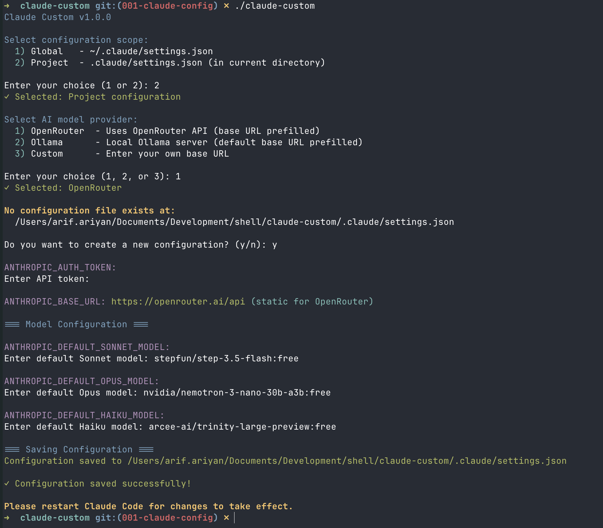
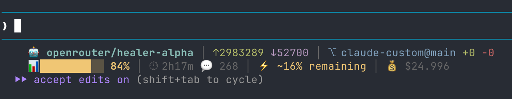
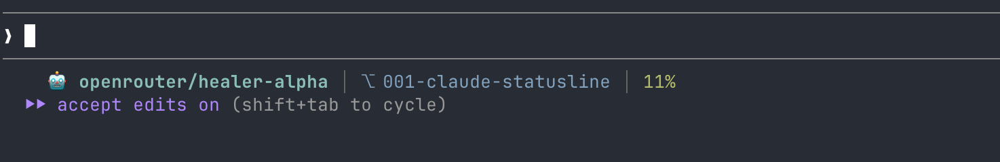
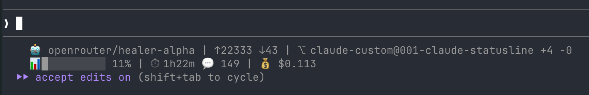

<div align="center">

# Claude Custom
<p align="center">
<pre>
    ▄▄█▄▄    ▄▄█▄▄  
   ██▀▀██   ██▀▀██ 
   ██        ██     
   ██        ██     
   ██▄▄██   ██▄▄██  
    ▀▀█▀▀    ▀▀█▀▀  
</pre>
</p>

*An interactive Bash CLI tool that configures Claude Code's `settings.json` with your preferred AI model provider. Set up OpenRouter, Ollama, or a custom endpoint in seconds.*

<br>

[](https://opensource.org/licenses/MIT) [](https://www.gnu.org/software/bash/) [](https://github.com/obiwancenobi/claude-custom) [](https://github.com/obiwancenobi/claude-custom/releases)

</div>

---

## ✨ Features

- **Flexible Scope**: Configure globally (`~/.claude/settings.json`) or per-project (`.claude/settings.json`)
- **Provider Support**:
  - **OpenRouter** — Pre-configured API endpoint
  - **Ollama** — Local LLM at `localhost:11434`
  - **Custom** — Your own base URL (Cerebras, AWS Bedrock, Azure AI, etc.)
- **Secure Input**: API tokens entered with masked input (echo disabled)
- **Smart Merging**: Preserves existing settings while updating credentials
- **Automatic Backups**: Timestamped backups before any changes
- **Reset Support**: Remove claude-custom keys with `-r` or `--reset` option
- **Statusline**: Optional colorful prompt statusline showing model, tokens, git, context bar, session duration, turn count, unpushed commits
- **Statusline Themes**: Choose between detailed, compact, or monochrome display modes

> **⚠️ Important**: When selecting models, ensure they support **tool use / function calling**. Not all models support this capability — check your provider's documentation for compatible models.

## 🔒 Security & Privacy

**100% local operation — zero data transmission. This tool only:**

- Write to your local settings.json
- Store credentials on your machine
- Mask input during token entry
- Let you choose config location (global or project)

Your API keys never leave your computer. The script is a configuration helper only — Claude Code itself handles all API communication.

## 📋 Requirements

- **Bash** 4.0 or later
- **jq** — Command-line JSON processor

Install jq if needed:

```bash
# macOS
brew install jq

# Ubuntu/Debian
sudo apt-get install jq

# Fedora
sudo dnf install jq

# Arch Linux
sudo pacman -S jq

# Alpine Linux
apk add jq
```

## 🚀 Installation

> **Note:** The statusline feature requires the `functions/statusline.sh` script. Installation methods that clone the full repo (Homebrew, Clone & Install) include this automatically. For other methods, the `--status` flag will not be available unless you clone the repo.

### Option 1: Homebrew (macOS/Linux) — Recommended

Install the formula (includes statusline support):

```bash
brew tap obiwancenobi/claude-custom https://github.com/obiwancenobi/claude-custom
brew install claude-custom
```

Update and upgrade:

```bash
brew update && brew upgrade claude-custom
```

### Option 2: Git Clone (Full features)

Clone the repo to get all files including statusline support:

```bash
git clone https://github.com/obiwancenobi/claude-custom.git /usr/local/share/claude-custom
sudo ln -sf /usr/local/share/claude-custom/claude-custom /usr/local/bin/claude-custom
```

Update later:

```bash
cd /usr/local/share/claude-custom && git pull
```

### Option 3: Local Use (No Install)

Run directly from the repository:

```bash
git clone https://github.com/obiwancenobi/claude-custom.git
cd claude-custom
./claude-custom
```

### Quick Install (Basic — no statusline)

Downloads only the main script. Statusline `--status` will not be available.

**curl:**

```bash
curl -sSL https://raw.githubusercontent.com/obiwancenobi/claude-custom/main/claude-custom | sudo tee /usr/local/bin/claude-custom > /dev/null && sudo chmod +x /usr/local/bin/claude-custom
```

**wget:**

```bash
wget -qO- https://raw.githubusercontent.com/obiwancenobi/claude-custom/main/claude-custom | sudo tee /usr/local/bin/claude-custom > /dev/null && sudo chmod +x /usr/local/bin/claude-custom
```

### Verify Installation

```bash
claude-custom --version
# Claude Custom v1.4.3
```

### Uninstall

```bash
# If installed via Homebrew
brew uninstall claude-custom

# If installed via clone/symlink
sudo rm -f /usr/local/bin/claude-custom
rm -rf /usr/local/share/claude-custom
```

## 🎯 Usage

Start the interactive configuration wizard:

```bash
claude-custom
```

### Command-Line Options

```bash
claude-custom -h, --help             # Display this help message
claude-custom -v, --version          # Show version information
claude-custom -s, --status           # Enable statusline in prompt
claude-custom -S, --status-disable   # Disable statusline in prompt
claude-custom -t, --theme            # Set statusline theme
claude-custom -r, --reset            # Reset configuration
```

### Statusline Commands

```bash
# Enable statusline
claude-custom --status

# Disable statusline
claude-custom --status-disable

# Set statusline theme (detailed/compact/monochrome)
claude-custom --theme
```

### What Gets Configured

The tool writes these environment variables to Claude Code's `settings.json`:

| Variable | Purpose |
|-----------|---------|
| `ANTHROPIC_AUTH_TOKEN` | Your API key (required) |
| `ANTHROPIC_BASE_URL` | API endpoint URL (auto-set for OpenRouter/Ollama) |
| `ANTHROPIC_DEFAULT_SONNET_MODEL` | Default Sonnet model name |
| `ANTHROPIC_DEFAULT_OPUS_MODEL` | Default Opus model name |
| `ANTHROPIC_DEFAULT_HAIKU_MODEL` | Default Haiku model name |
| `STATUSLINE_THEME` | Statusline display theme (`detailed`/`compact`/`monochrome`) |

## 🖼️ Preview



# 🎯 Statusline



Enable a colorful statusline in your Claude Code prompt that displays:

- 🤖 **Model** — Current model identifier
- ↑/↓ **Tokens** — Input/output token counts
- ⎇ **Git** — Branch name + diff status (+N -N)
- ↑N **Unpushed** — Commits ahead of upstream
- [████] **Context** — Progress bar with percentage
- ⏱ **Duration** — Session elapsed time
- 💬 **Turns** — Number of exchanges
- ⚡ **Compaction** — Exchanges until compaction
- $ **Cost** — Session cost in USD

### Enable Statusline

```bash
claude-custom --status
# → Select scope (Global/Project)
# → Confirm
```

### Disable Statusline

```bash
claude-custom --status-disable
# → Select scope (Global/Project)
# → Confirm
# → Removes statusline config and script
```

### Set Statusline Theme

```bash
claude-custom --theme
# → Select scope (Global/Project)
# → Choose theme:
#    1. detailed   - Full info (default)
#    2. compact    - Minimal: model, branch, context %
#    3. monochrome - No colors, plain text
```

Theme is stored in `settings.json` under `env.STATUSLINE_THEME`.

**Detailed** (default) — Full info with colors, 2-line layout:


**Compact** — Minimal, single line:


**Monochrome** — No colors, plain text:


## 🛠️ How It Works

1. **Choose scope** — Decide between global or project configuration
2. **Select provider** — Pick OpenRouter, Ollama, or Custom
3. **Enter credentials** — Provide API token (masked)
4. **Configure base URL** — Set your API endpoint (auto-set for OpenRouter/Ollama)
5. **Select models** — Configure Sonnet, Opus, and Haiku model names
6. **Save & backup** — Existing config is backed up with timestamp, then updated

On first run, if no configuration exists, you'll be prompted to create one. Subsequent runs will show current values and allow you to update them.

See [DIAGRAMS.md](DIAGRAMS.md) for detailed flow diagrams, component architecture, data flows, and state machine diagrams.

## 💡 Examples

```bash
claude-custom
# → Scope: Global
# → Provider: OpenRouter
# → API token: (enter your OpenRouter key)
# → Models: (accept defaults or customize)
```

### Configure Ollama for a specific project

```bash
cd /path/to/project
claude-custom
# → Scope: Project
# → Provider: Ollama
# → Uses http://localhost:11434 automatically
```

### Reset Configuration

Remove claude-custom keys from your settings.json:

```bash
claude-custom -r
# → Select scope: Global or Project
# → Confirm reset
# → Backup created, keys removed
```

### Switch providers

Just run `claude-custom` again and select a different provider. The old configuration is preserved as a backup.

### Change statusline theme

```bash
claude-custom --theme
# → Select scope: Global or Project
# → Choose: detailed, compact, or monochrome
# → Theme saved to settings.json
```

## 🔧 Troubleshooting

**"jq is required but not installed"**
→ Install jq using the instructions above for your operating system.

**"Cannot create directory/file"**
→ Check write permissions for the target location (`~/.claude/` for global, current directory for project).

**"Invalid or missing settings.json"**
→ The tool will create a new valid configuration. If you have an existing corrupted file, it will be backed up before being replaced.

**Changes not taking effect**
→ Restart Claude Code after running `claude-custom`.

## 📄 License

See the [LICENSE](LICENSE) file for details.

---

## 👤 Author

**Arif Ariyan**  
[beetlix.com](https://beetlix.com) · [riffcompiler.com](https://riffcompiler.com)
